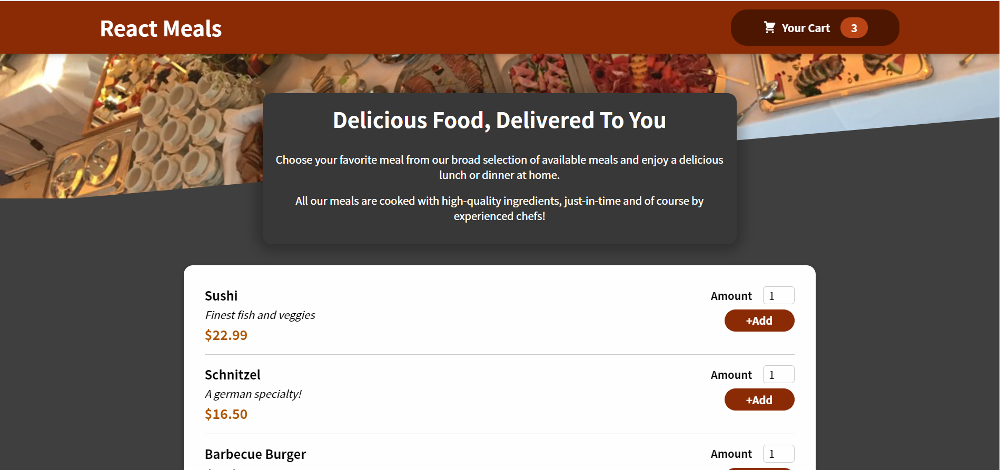
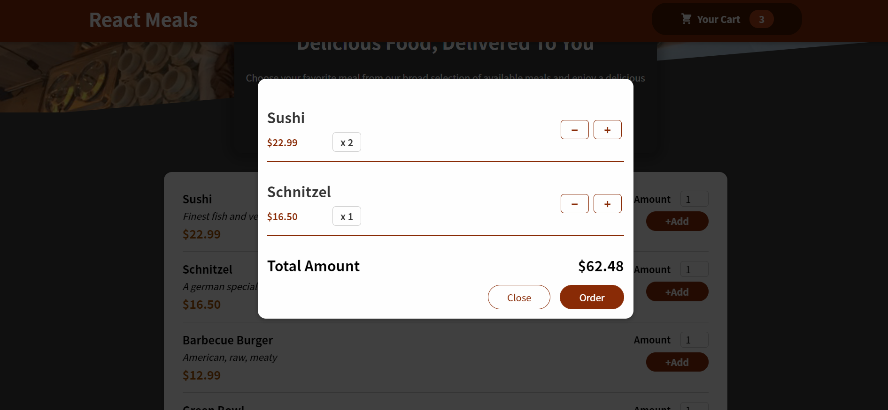

# 챕터 11 리액트 토이프로젝트

미리보기 이미지


---

## 배운점(Hook 사용)
### 1. Context API 사용하기
### 2. useReducer 사용하기 
### 3. 기타 Hook 사용하기
---

## Context API

이번 프로젝트에서 음식 목록과 수량을 + - 하는 상태관리를 Context API와 useReducer 를 사용 하였습니다.


### 1. createContext

```javascript
// 1. store 폴더 생성
// 2. cart-context.js 와 CartProvider.js 파일 생성

// cart-context 실제 ContextAPI 를 작성

import React from "react"

const CartContext = React.createContext({
  items: [], // 장바구니 담긴 목록
  totalAmount : 0, // 장바구니 총 값
  addItem: (item) => {}, // 장바구니 추가
  removeItem: (id) => {}, // 장바구니 삭제
})

export default CartContext

// 여기에는 createContext 로 초기 값 들을 작성해줌. 
```

### 2. ContextProvider
```javascript
// 다른 폴더 Provider 를 위해
// CartProvider.js 를 생성

import React, {useReducer} from "react"
import CartContext from "./cart-context" // 위에서 만든 createContext를 불러온다.

const CartProvider = (props) => {

  const cartContext = {
    items : [],
    totalAmount  : 0,
    addItem : () => {},
    removeItem : () => {}
  }

  return (
    <CartContext.Provider value={cartContext}>{props.children}
    </CartContext.Provider>
  )
}

// Provider 로 감싸주고 value 값 들을  전역으로 넘겨준다.
```

### 3. APP.js

```javascript
// 다시 App.js에서 위에서 만든 CartPorvider 를 감싸주면 된다.

import React from "react"

const App = () => {

  return (
    <CartProvider>
      <main>
    </CartProvider>
  )
}
```
### 4. useContext(CartContext)

```javascript
// context 가 필요한 곳에 사용 해주면 된다.

// header

import React, { useContext, useState } from "react"
import CartContext from "../../store/cart-context"

const HeaderCartButton = (props) => {
  const cartCtx = useContext(CartContext)

  const { items } = cartCtx

  return (
    <div>{items.length}</div>
  )
}

// items 들의 길이로 장바구니에 담긴  갯수를 측정.
```
---
## useReducer
자 이제 context api 로 전역에 데이터를 뿌릴텐데 이걸 어떻게 사용할까?
useRedcuer 로 그 데이터 들을 상태관리 해준다.

### 1. useReducer 선언

>const [state, dispatch] = useReducer(reducer, initialState);

1. state : 사용 할 state 값
2. dispatch : 액션을 발생 시키는 함수
3. reducer : reducer 함수
4. initialState : 초기 값

**사용예제**

```javascript 
import React, { useReducer } from "react"


// 4. 초기화 값
const defaultCartState = {
  items : [],
  totalAmount : 0,
}

// 3. reducer 함수
const cartReducer = (state, action) => {
  if(action.type === "ADD"){

  }
  if(action.type === "REMOVE"){

  }
  return defaultCartState
}

const [cartState, dispatchCartAction] = useReducer(cartReducer, defaultCartState)

const addItemToCartHandler = (item) => {
  // 2. 액션을 발생 시킬 함수(디스패치)
  dispatchCartAction({
    type: "ADD",
    item: item
  })
}

const cartContext = {
  // 1. 현재 저장 된 state 값 사용
  item : cartState.items,
  totalAmount : cartState.totalAmount,
  addItem : addItemToCartHandler
}
```
---
## 기타 Hook 사용하기

- input element forwardRef
```javascript
import React from "react"
import classes from "./Input.module.css"

const Input = React.forwardRef((props, ref) => {
  // ref 값도 props 처럼 받아서 쓸 수 있다.
  return (
    <div className={classes.input}>
      <label htmlFor={props.input.id}>{props.label}</label>
      <input ref={ref} {...props.input} />
    </div>
  )
})

export default Input
```
- Modal portalElemnet

```javascript
// div root 이외로 최상위로 끌어 올린다.
const portalElement = document.getElementById("overlays")

const Modal = (props) => {
  return (
    <>
      {ReactDOM.createPortal(
        <Backdrop onClose={props.onClose} />,
        portalElement
      )}
      {ReactDOM.createPortal(
        <ModalOverlay>{props.children}</ModalOverlay>,
        portalElement
      )}
    </>
  )
}

export default Modal
```