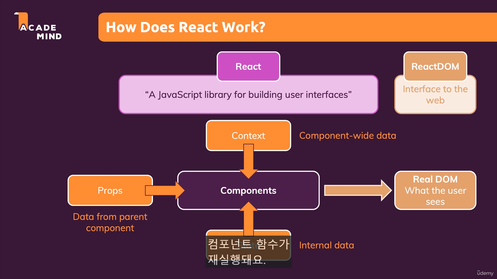
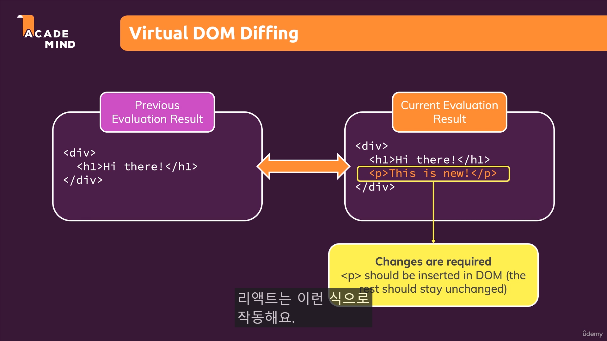

# 리액트가 작동하는 방식



## 컴포넌트

1. 가상 돔 vs 리얼 돔 비교  
   현재 화면과 바뀔 화면과 비교해서 바뀔 부부만 다시 그리는 방식
2. props  
   부모, 자식 컴포넌트를 연결해주는 컴포넌트 데이터 (**외부데이터**)
3. state  
   컴포넌트 내부에서 관리하는 **내부 데이터**
4. context  
   컴포넌트 전체 데이터

### 컴포넌트의 재렌더링

props, state, context가 변할 때마다 리액트가 그것들을 쓰는 컴포넌트를 업데이트하고, 컴포넌트가 화면에 새로운 내용을 띄우려는지 확인합니다.

새로운 내용이 있으면 리액트가 ReactDOM에 전달해서 새로운 화면, 즉 새로운 컴포넌트를 화면에 띄웁니다.

리액트는 컴포넌트 위주입니다.
리액트는 가상 DOM을 사옹하는데, 가상 DOM은 컴포넌트 트리를 결정합니다.

모든 컴포넌트에는 JSX 코드를 return 하는 하위 트리가 있는데,

가상 DOM은 트리의 현재 모양과 최종모양을 정하고, state를 업데이트 한 후 그 정보를 React DOM이 전달 받고 그 차이점을 파악 한 후 real DOM 과 가상 DOM을 맞추기 위해 real DOM을 조작합니다.

하지만 너무 많은 비교로 realDOM을 소모하면 **페이지가 느려**집니다!

---

## 간단한 예제



```javascript
// 현재 컴포넌트
<div>
  <h1>Hi There </hi>
</div>

// 바뀔 컴포넌트
<div>
  <h1>Hi There </hi>
  <p>This is new!</p>
  // 이전 돔과 비교하여 div, h1 부분은 건드리지 않고 p 태그 부분만 삽입을 하게 된다!
</div>

```
