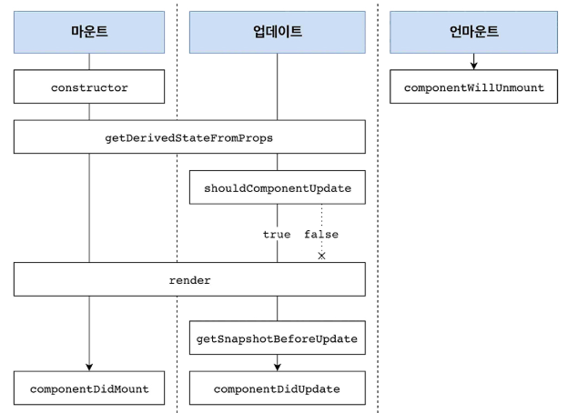

# 클래스형 컴포넌트 라이프 사이클

라이프사이클 메서드의 종류는 총 9가지입니다.

**Will** 접두사가 붙은 메서드는 **어떤 작업을 작동하기 전 실행** 

**Did** 접두사가 붙은 메서드는 **어떤 작업을 작동한 후에 실행**

라이프사이클은 총 세가지 카테고리로 구분

1. 마운트,
2. 업데이트
3. 언마운트

---
## **마운트**

DOM이 생성되고 웹 브라우저상에 나타나는 것을 마운트라고 함.

### 마운트 과정에 해당되는 메서드

- **constructor** 컴포넌트를 새로 만들 때 마다 호출되는 클래스 생성자메서드
- **getDerivedStateFromProps**  prop에 있는 값을 state에 넣을 때 사용하는 메서드
- **render()**: 우리가 UI를 렌더링하는 메서드
- **componentDidMount** : 컴포넌트가 웹 브라우저 상에 나타난 후 호출되는 메서드

---
## **업데이트**

컴포넌트는 4가지의 경우 업데이트를 합니다.

- props의 변경
- state의 변경
- 부모 컴포넌트의 리렌더링
- this.forceUpdatae로 강제로 렌더링을 트리거할 때

### 업데이트에 해당 되는 메서드

- **getDerivedStateFromProps** 마운트 과정에서도 소개를 드린 메서드로써 props에 따라 state 값이 변화를 주기 때문에  업데이트에도 해당 됩니다.
Props 로 받아 온 값을 state에 동기화 시키는 용도

- **shouldComponentUpdate** 컴포넌트가 리렌더링을 해야 할지 말아야 할지를 결정하는 메서드 이 메서드는 true혹은 false값을 반환해야 하고 true를 반환하면 다음 라이프사이클 메서드를 계속 실행하고 false를반환하면 작업을 중지합니다.
- **getSnapshotBeforeUpdate** 컴포넌트 변화를 DOM에 반영하기 바로 직전에 호출하는 메서드

- **componentDidUpdate** 컴포넌트의 업데이트 작업이 끝난 후 호출하는 메서드

---

## **언마운트**

마운트의 반대과정, 컴포넌트를 DOM에서 제거하는 것

메서드

- **componentWillUnmount** 