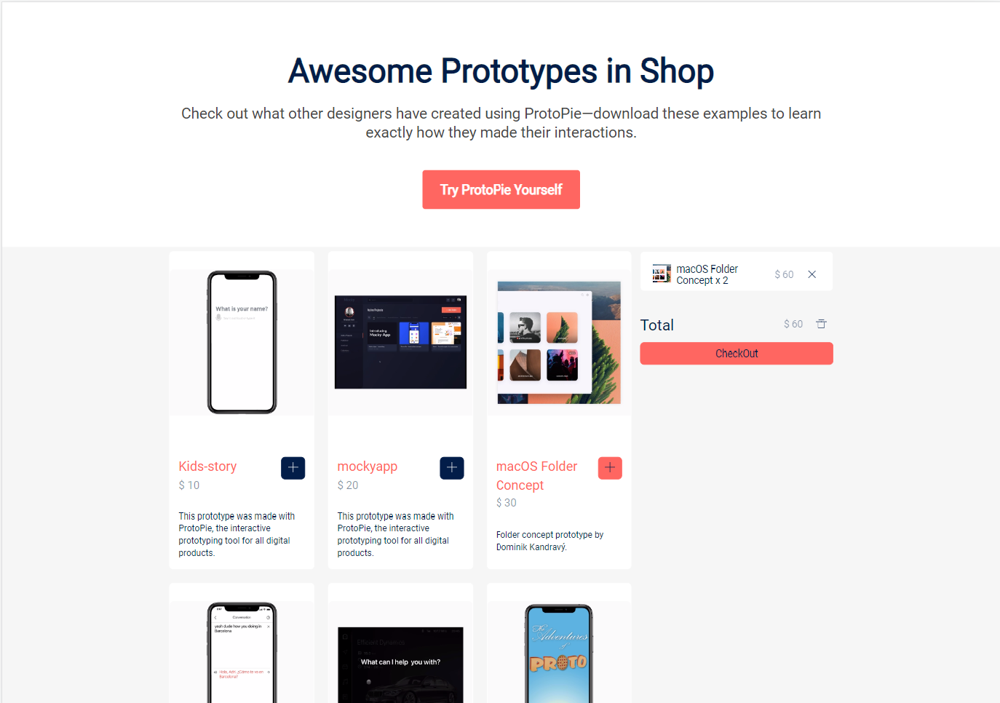

# 리액트 강의
  


# 배운점
### React Hook에 대해서 일반적으로 많이 쓰는 useEffect, useState 이외에 useContext 와 useCallback, useMemo 에 대해서 언제 어떻게 쓰는지 감이 잘 오지 않았는데 실 사용하면서 작은 프로젝트를 해보니까 알 것 같다.

---

## 사용한 훅 Hook

*  useContext
* useCallback
* useMemo
---
### useContext

**아래와 같은 데이터들을 전역으로 관리함**

- Prototypes
- order
- addToOrder
- remove
- removeAll

---

### useCallback()

**함수를 메모이제이션 할 때 쓴다.**

추가 / 삭제 / 모두 삭제 할 때 사용
- addToOrder
- remove
- removeAll

---

### useMemo()

**값을 메모이제이션 할 때 쓴다.**

총 값을 계산 할 때 주문품이 달라 질 경우 이 부분만 다시 렌더링한다.

- totalPrice

### **실사용예제코드**
```javascript
// useMemo
  const totalPrice = useMemo(() => {
    // 1. 주문 물건들의 배열을 map으로 돌고
    return orders
      .map((order) => {
        const { id, quantity } = order

        // 2. 주문 물건과 가게 물건 중 id가 값은 값에
        const prototype = prototypes.find((p) => p.id === id)

        // 3. 가격 * 수량을 한다.
        return prototype.price * quantity
      })
      .reduce((l, r) => l + r, 0)
      // 의존성 배열, 이 값이 바뀌면 다시 실행한다
      // 주문 물건이 담긴 배열
  }, [orders, prototypes])
```
